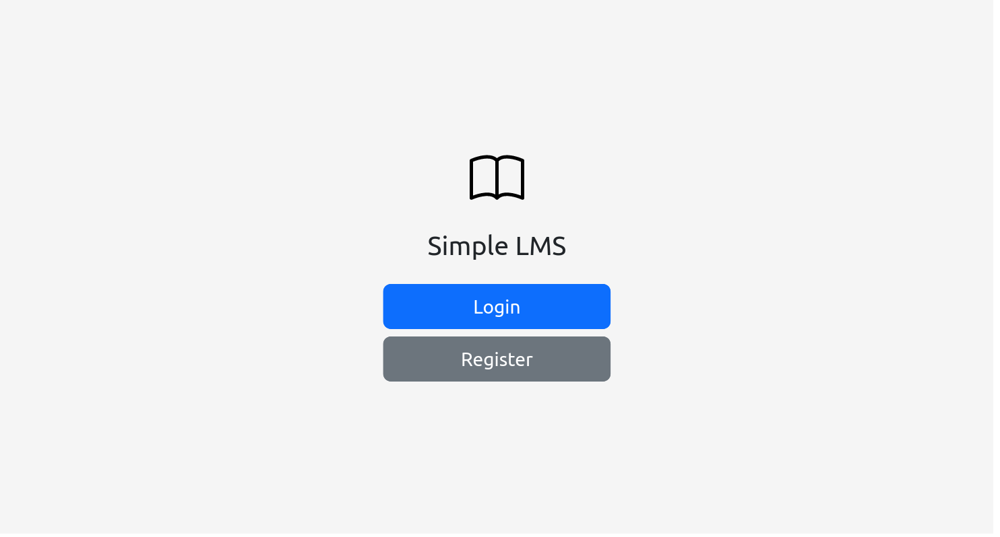
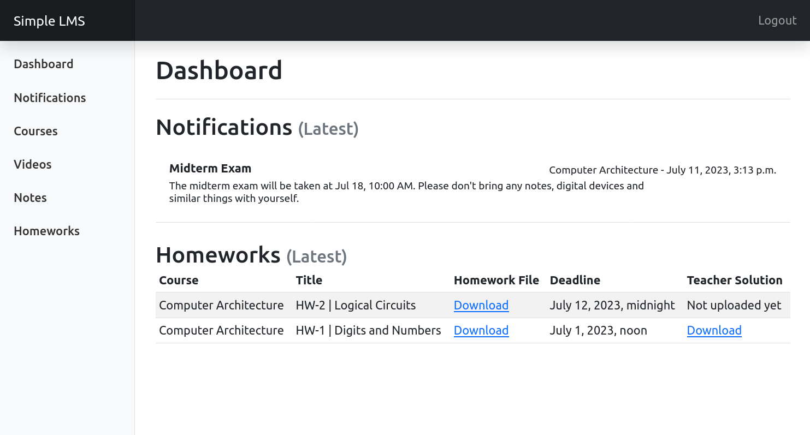
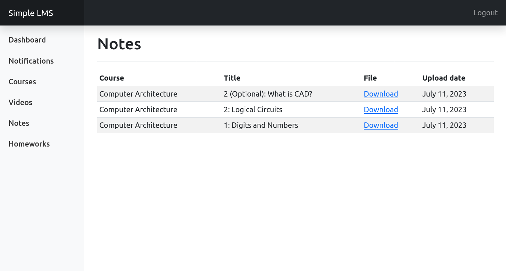
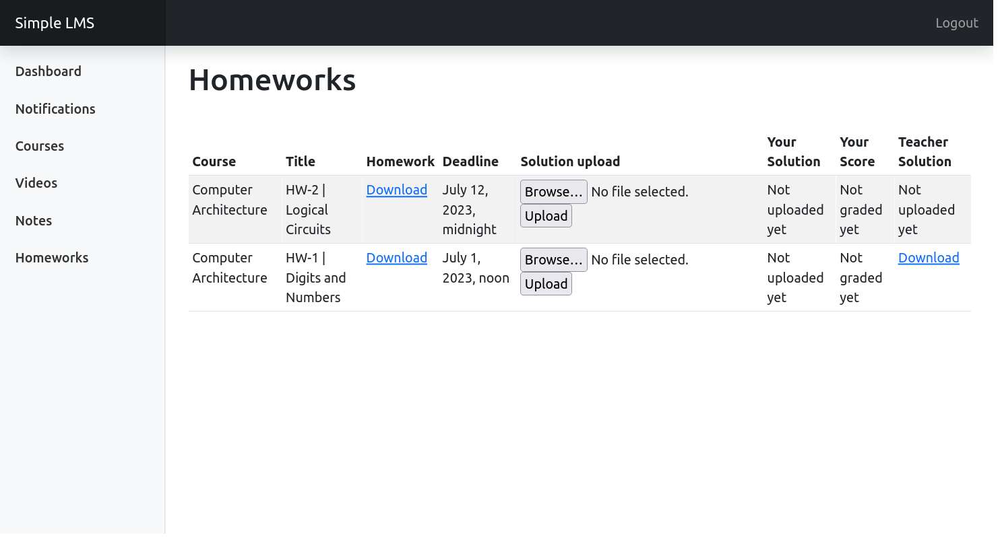

# SimpleLMS
A simple learning management system, written in Python/Django with abilities to define and enroll the students in courses by the teacher, upload course videos, notes and homeworks and uploading response for homeworks by the students. Used Django templates and Bootstrap for user interface.

## Screenshots

